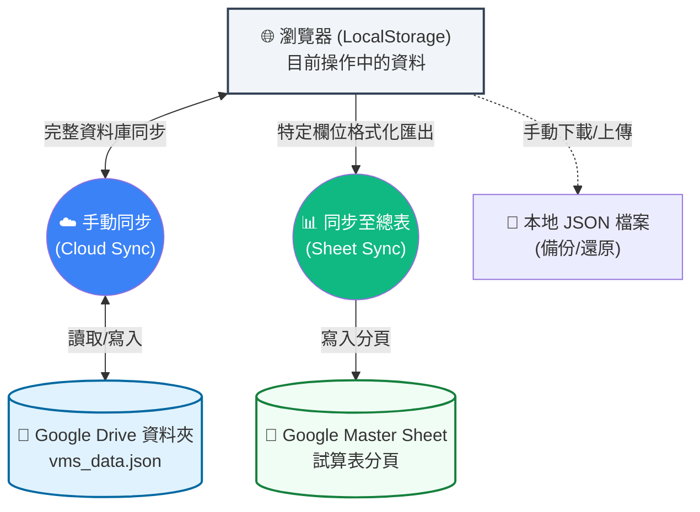

# 系統資料流與同步機制說明 (System Data Flow)

為了讓您更清楚「連線設定」、「手動同步」與「同步至總表」的運作邏輯，以下用圖表呈現資料在各個節點間的流向：

## 1. 資料互通關係圖 (Relationship Overview)

---

## 2. 功能差異詳細對照 (Feature Comparison)

| 比較項目 | ☁️ 手動同步 (Cloud Sync) | 📊 同步至總表 (Sheet Sync) |
| :--- | :--- | :--- |
| **存放位置** | Google Drive 指定資料夾 | Google Sheets 指定試算表 |
| **儲存格式** | `vms_data.json` (純文字資料庫) | Excel 表格欄位 (Rows & Columns) |
| **主要目的** | **跨開發設備同步**、全系統備份 | **製作報告**、給長官/客戶檢閱進度 |
| **資料完整度** | **100%** (包含所有隱藏設定與階層) | **約 30%** (僅關鍵進度與燈號) |
| **覆蓋邏輯** | 雙向同步 (自動比對新舊) | 單向寫入 (依照日期/編號覆蓋) |
| **設定位置** | 連線設定中的「專案儲存資料夾 ID」 | 連線設定中的「Master Sheet ID」 |

---

## 3. 核心流程說明

1.  **連線設定 (⚙️ Settings)**：
    *   這是最重要的起點。您在「挑選資料夾」後，系統才知道 `vms_data.json` 要存哪裡。
    *   您在「挑選試算表」後，系統才知道 Excel 進度表要寫到哪一張。

2.  **手動同步 (☁️ Sync)**：
    *   這就像是遊戲的「雲端存檔」。當您在辦公室做完，點一下同步，回家後在另一台電腦登入後再點一下，資料就會完整接續。

3.  **同步至總表 (📊 Export)**：
    *   這就像是「產出成果報告」。它不會幫您備份系統資料，如果您換電腦後沒做過「手動同步」，試算表上的資料是救不回系統裡的。
    *   如果同步失敗 (403 Error)，代表您對總表沒權限，此時請在「連線設定」用 **「另存副本」** 建立自己的表。
